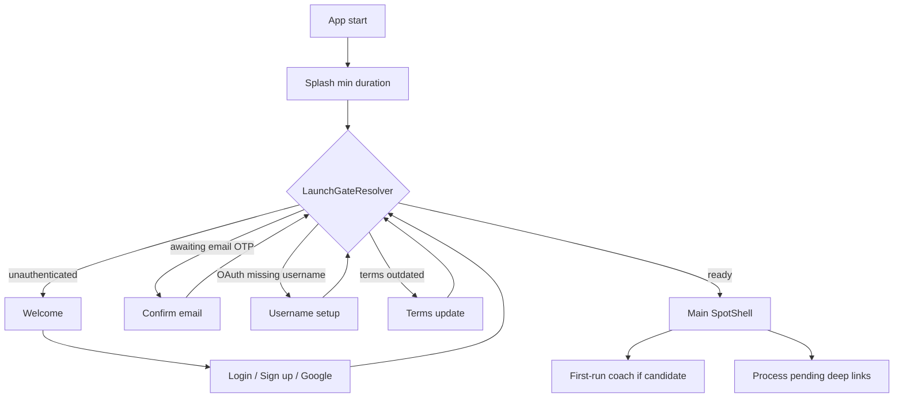

# App launch & auth gate (Android)

```mermaid
flowchart TD
  start[App start] --> splash[Splash min duration]
  splash --> resolve{LaunchGateResolver}
  resolve -->|unauthenticated| welcome[Welcome]
  resolve -->|awaiting email OTP| confirm[Confirm email]
  resolve -->|OAuth missing username| username[Username setup]
  resolve -->|terms outdated| terms[Terms update]
  resolve -->|ready| shell[Main SpotShell]
  welcome --> auth[Login / Sign up / Google]
  auth --> resolve
  confirm --> resolve
  username --> resolve
  terms --> resolve
  shell --> coach[First-run coach if candidate]
  shell --> pending[Process pending deep links]
```

Code: `feature/launch/SpotAppRoot.kt`, `LaunchGateResolver`, `AuthViewModel`.
