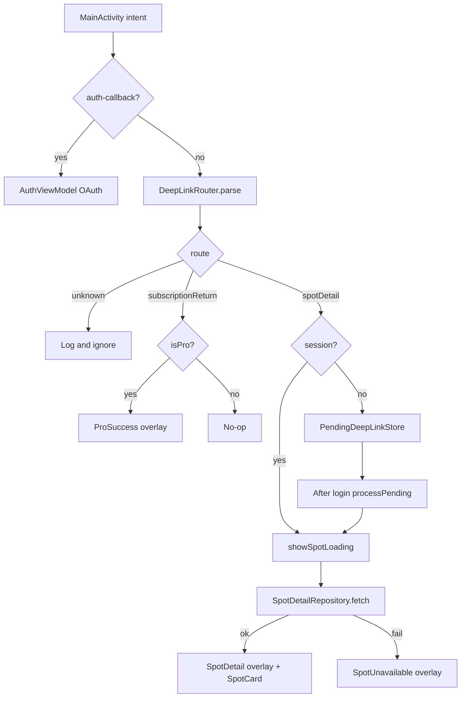

# Deep link flow (Android)

```mermaid
flowchart TD
  intent[MainActivity intent] --> authCb{auth-callback?}
  authCb -->|yes| oauth[AuthViewModel OAuth]
  authCb -->|no| parse[DeepLinkRouter.parse]
  parse --> route{route}
  route -->|unknown| log[Log and ignore]
  route -->|subscriptionReturn| pro{isPro?}
  pro -->|yes| success[ProSuccess overlay]
  pro -->|no| noop[No-op]
  route -->|spotDetail| authed{session?}
  authed -->|no| store[PendingDeepLinkStore]
  authed -->|yes| load[showSpotLoading]
  load --> fetch[SpotDetailRepository.fetch]
  fetch -->|ok| detail[SpotDetail overlay + SpotCard]
  fetch -->|fail| unavailable[SpotUnavailable overlay]
  store --> later[After login processPending]
  later --> load
```

Code: `DeepLinkCoordinator`, `MainActivity`, `OverlayHost`.
