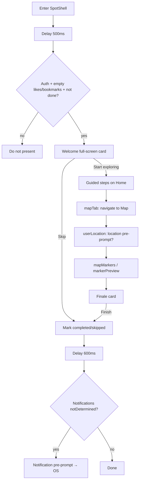

# First-run coach flow (Android)

```mermaid
flowchart TD
  shell[Enter SpotShell] --> delay[Delay 500ms]
  delay --> gate{Auth + empty likes/bookmarks + not done?}
  gate -->|no| skipTour[Do not present]
  gate -->|yes| welcome[Welcome full-screen card]
  welcome -->|Start exploring| steps[Guided steps on Home]
  welcome -->|Skip| complete[Mark completed/skipped]
  steps --> mapTab[mapTab: navigate to Map]
  mapTab --> loc[userLocation: location pre-prompt?]
  loc --> markers[mapMarkers / markerPreview]
  markers --> finale[Finale card]
  finale -->|Finish| complete
  complete --> notifDelay[Delay 600ms]
  notifDelay --> notif{Notifications notDetermined?}
  notif -->|yes| prePrompt[Notification pre-prompt → OS]
  notif -->|no| done[Done]
```

Code: `FirstRunOnboardingViewModel`, `FirstRunOnboardingHost`, `PermissionsViewModel`.
